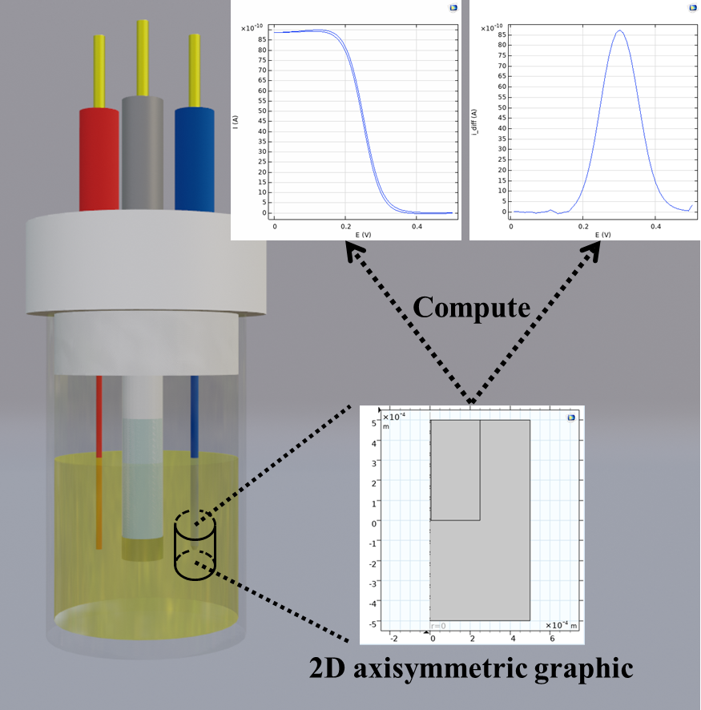

# **A Beginner’s Guide to Simulation of Electroanalytical Experiments using COMSOL Multiphysics&reg;**

This GitHub repo contains all COMSOL files and corresponding data for our paper titled "A Beginner’s Guide to Simulation of Electroanalytical Experiments using COMSOL Multiphysics". This paper provides theories and step-by-step tutorials on implementing COMSOL models utilizing the Transport of Diluted Species physics module of COMSOL for electroanalytical experiments. 
The implementation of the COMSOL model is demonstrated using COMSOL version 5.6 on Ubuntu 22.04 LTS operating system. Note that variations may exist for other versions of COMSOL. 

 

In particular, we cover the simulation of 

1. Section 1: steady-state current (Iss)
2. Section 2: cyclic voltammetry (CV)
3. Section 3: differential pulse voltammetry (DPV)

  

 

